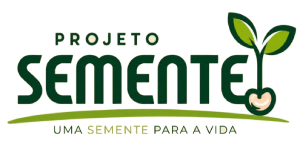
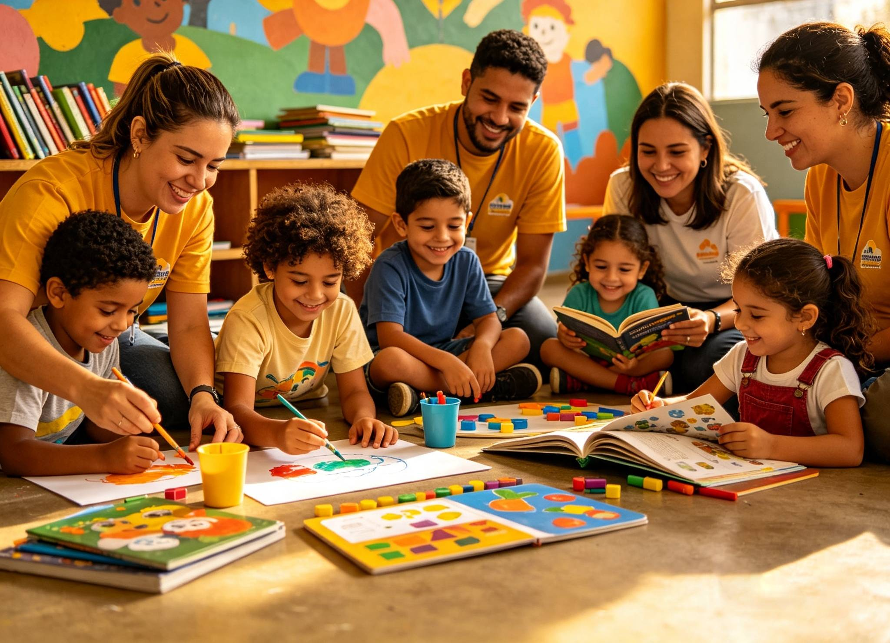
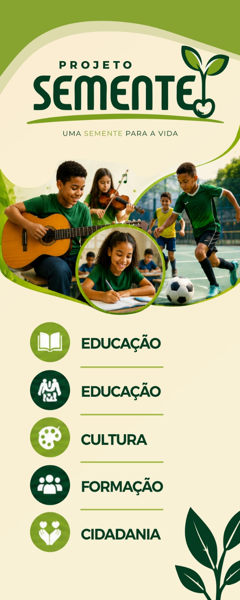
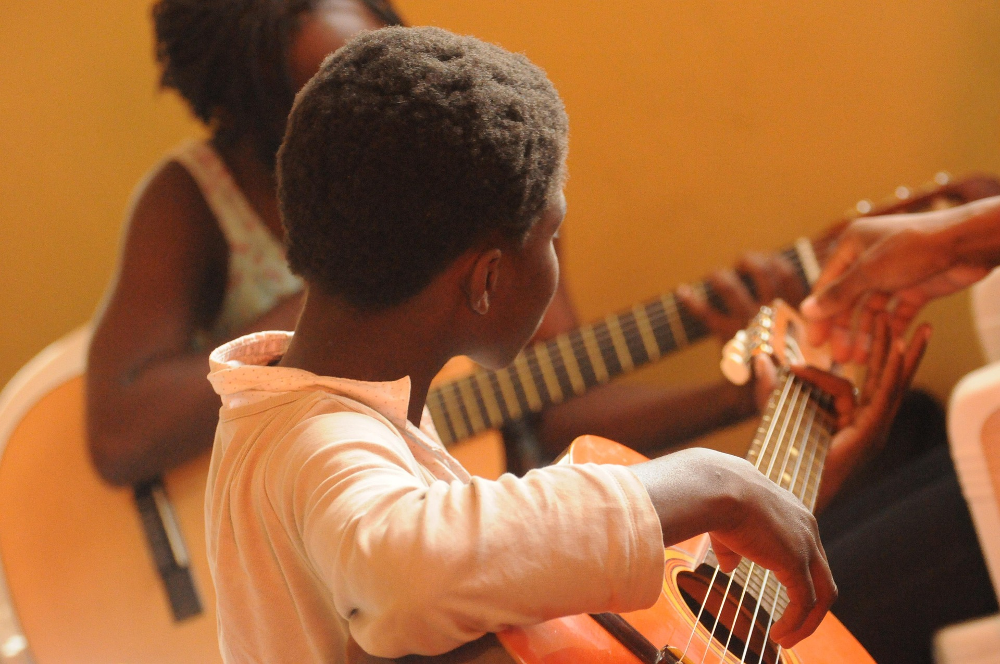
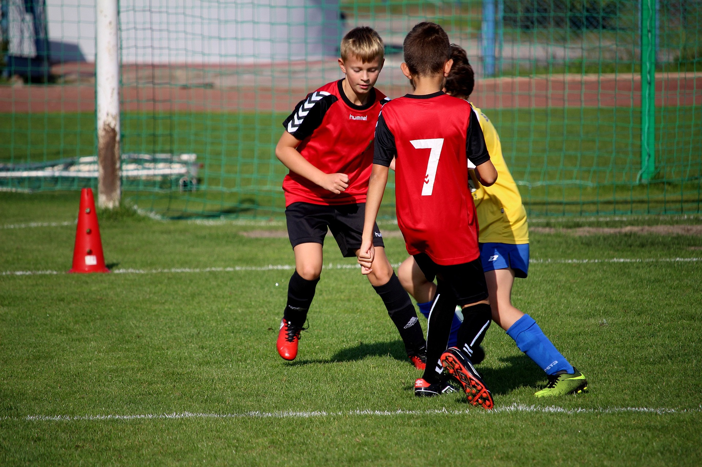
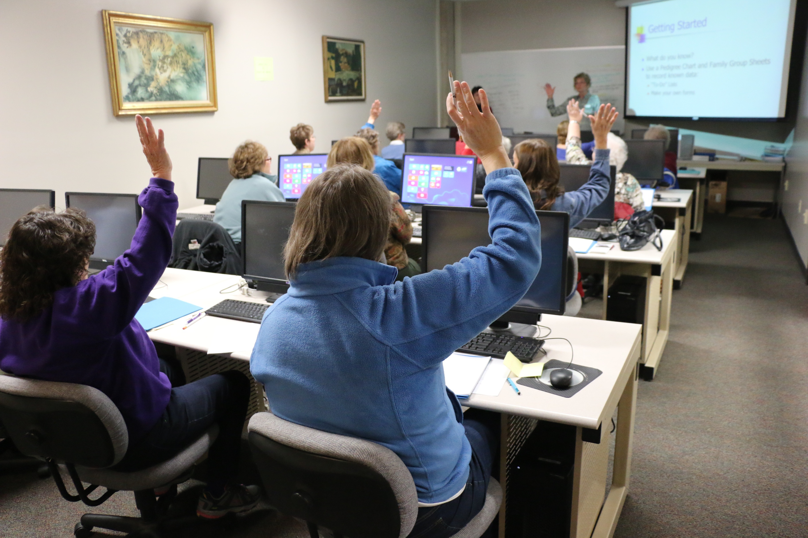

<!DOCTYPE html>
<html lang="pt-BR">

<head>

    <!-- =========================================================
         METADADOS
    ========================================================== -->

    <meta charset="UTF-8">

    <meta name="viewport"
          content="width=device-width, initial-scale=1.0">

    <meta http-equiv="X-UA-Compatible"
          content="IE=edge">

    <title>
        Projeto Semente | Uma Semente para a Vida
    </title>

    <meta name="description"
          content="Projeto Semente - Educação, cultura, esporte, tecnologia e cidadania transformando vidas em Santa Rita, Paraíba.">

    <meta name="keywords"
          content="Projeto Semente, projeto social, Santa Rita PB, educação, cultura, esporte, música, informática, reforço escolar">

    <meta name="author"
          content="Projeto Semente">

    <meta name="robots"
          content="index, follow">

    <!-- =========================================================
         OPEN GRAPH
    ========================================================== -->

    <meta property="og:locale"
          content="pt_BR">

    <meta property="og:type"
          content="website">

    <meta property="og:title"
          content="Projeto Semente | Uma Semente para a Vida">

    <meta property="og:description"
          content="Transformando vidas através da educação, cultura, esporte e cidadania.">

    <meta property="og:image"
          content="assets/img/og-image.jpeg">

    <meta property="og:url"
          content="https://projetosementepb.com.br">

    <!-- =========================================================
         TEMA
    ========================================================== -->

    <meta name="theme-color"
          content="#05401F">

    <!-- =========================================================
         FAVICON
    ========================================================== -->

    <link rel="icon"
          type="image/png"
          sizes="32x32"
          href="assets/img/favicon.png">

    <link rel="icon"
          type="image/png"
          sizes="16x16"
          href="assets/img/favicon.png">

    <link rel="apple-touch-icon"
          href="assets/img/favicon.png">

    <!-- =========================================================
         FONTES
    ========================================================== -->

    <link rel="preconnect"
          href="https://fonts.googleapis.com">

    <link rel="preconnect"
          href="https://fonts.gstatic.com"
          crossorigin>

    <link rel="stylesheet"
          href="https://fonts.googleapis.com/css2?family=Poppins:wght@300;400;500;600;700;800&family=Nunito:wght@300;400;600;700;800&display=swap">

    <!-- =========================================================
         BOOTSTRAP ICONS
    ========================================================== -->

    <link rel="stylesheet"
          href="https://cdn.jsdelivr.net/npm/bootstrap-icons@1.13.1/font/bootstrap-icons.min.css">

    <!-- =========================================================
         CSS
    ========================================================== -->

    <link rel="stylesheet"
          href="assets/css/variables.css">

    <link rel="stylesheet"
          href="assets/css/reset.css">

    <link rel="stylesheet"
          href="assets/css/style.css">

    <link rel="stylesheet"
          href="assets/css/responsive.css">

</head>

<body>

<!-- =============================================================
     HEADER
============================================================== -->

<header id="header">

    

        <!-- LOGO -->

        

        <!-- MENU -->

        <nav id="menu"
             aria-label="Navegação principal">

            <ul>

                <li>
                    <a href="#inicio">
                        Início
                    </a>
                </li>

                <li>
                    <a href="#sobre">
                        Quem Somos
                    </a>
                </li>

                <li>
                    <a href="#oficinas">
                        Oficinas
                    </a>
                </li>

                <li>
                    <a href="#galeria">
                        Galeria
                    </a>
                </li>

                <li>
                    <a href="#pre-matricula">
                        Pré-matrícula
                    </a>
                </li>

                <li>
                    <a href="#contato">
                        Contato
                    </a>
                </li>

            </ul>

        </nav>

        <!-- AÇÕES -->

        

            <a href="login.html" class="btn">
    <i class="bi bi-person-circle"></i>
    Área do Sistema
</a>

            <a href="#pre-matricula"
               class="btn">

                Pré-matrícula

            </a>

        

        <!-- MENU MOBILE -->

        <button id="btn-menu"
                class="btn-menu"
                type="button"
                aria-label="Abrir menu"
                aria-expanded="false"
                aria-controls="menu">

            <i class="bi bi-list"></i>

        </button>

    

</header>

<!-- =============================================================
     HERO
============================================================== -->

<section id="inicio"
         class="hero">

    

    

        

            
                PROJETO SOCIAL
            

            <h1>
                Uma Semente
                 
                para a Vida
            </h1>

            

                Educação • Cultura • Esporte • Formação • Cidadania
            

            

                <a href="#sobre"
                   class="btn">

                    Conheça o Projeto

                </a>

                <a href="#pre-matricula"
                   class="btn-outline">

                    Faça sua pré-matrícula

                </a>

            

        

    

    <a href="#sobre"
       class="scroll-down"
       aria-label="Conhecer o projeto">

        <i class="bi bi-chevron-double-down"></i>

    </a>

</section>

<!-- =============================================================
     QUEM SOMOS
============================================================== -->

<section id="sobre"
         class="sobre section">

    

        

            
                QUEM SOMOS
            

            <h2>
                Plantando hoje as sementes de um futuro melhor.
            </h2>

            

        

        

            

                

            

            

                
                    UMA OPORTUNIDADE PODE MUDAR UMA VIDA
                

                <h3>
                    Educação que transforma.
                    Oportunidades que permanecem.
                </h3>

                

                    O Projeto Semente nasceu com o propósito de
                    oferecer oportunidades para crianças e
                    adolescentes por meio da educação, cultura,
                    esporte e formação cidadã.
                

                

                    Acreditamos que investir em pessoas é
                    transformar famílias, fortalecer comunidades
                    e construir uma sociedade melhor.
                

                

                    Cada oficina representa uma oportunidade de
                    descobrir talentos, desenvolver habilidades
                    e cultivar valores para toda a vida.
                

                <a href="#oficinas"
                   class="btn">

                    Conheça nossas oficinas

                </a>

            

        

    

</section>

<!-- =============================================================
     MISSÃO / VISÃO / VALORES
============================================================== -->

<section class="mvv section">

    

        

            <article class="card-mvv">

                

                    <i class="bi bi-bullseye"></i>

                

                <h3>
                    Missão
                </h3>

                

                    Promover inclusão, desenvolvimento humano
                    e oportunidades por meio da educação,
                    cultura, esporte e cidadania.
                

            </article>

            <article class="card-mvv">

                

                    <i class="bi bi-eye"></i>

                

                <h3>
                    Visão
                </h3>

                

                    Ser referência em projetos sociais que
                    transformam vidas através do conhecimento
                    e do cuidado com as pessoas.
                

            </article>

            <article class="card-mvv">

                

                    <i class="bi bi-heart-fill"></i>

                

                <h3>
                    Valores
                </h3>

                

                    Amor ao próximo, ética, responsabilidade,
                    respeito, compromisso e esperança.
                

            </article>

        

    

</section>

<!-- =============================================================
     OFICINAS
============================================================== -->

<section id="oficinas"
         class="oficinas section">

    

        

            
                NOSSAS OFICINAS
            

            <h2>
                Descobrindo talentos e transformando vidas.
            </h2>

            

            

                Atividades que desenvolvem habilidades,
                promovem inclusão social e fortalecem valores
                essenciais para o crescimento.
            

        

        

            <article class="card-oficina">

                

                    <i class="bi bi-music-note-beamed"></i>
                

                <h3>
                    Música
                </h3>

                

                    Violão, teclado, violino, bateria,
                    flauta e canto.
                

            </article>

            <article class="card-oficina">

                

                    <i class="bi bi-dribbble"></i>
                

                <h3>
                    Futebol
                </h3>

                

                    Esporte, disciplina, respeito
                    e trabalho em equipe.
                

            </article>

            <article class="card-oficina">

                

                    <i class="bi bi-stars"></i>
                

                <h3>
                    Ballet
                </h3>

                

                    Expressão corporal, arte e
                    desenvolvimento.
                

            </article>

            <article class="card-oficina">

                

                    <i class="bi bi-shield-check"></i>
                

                <h3>
                    Judô
                </h3>

                

                    Disciplina, respeito e
                    autoconfiança.
                

            </article>

            <article class="card-oficina">

                

                    <i class="bi bi-laptop"></i>
                

                <h3>
                    Informática
                </h3>

                

                    Inclusão digital, tecnologia
                    e inovação.
                

            </article>

            <article class="card-oficina">

                

                    <i class="bi bi-book"></i>
                

                <h3>
                    Reforço Escolar
                </h3>

                

                    Apoio ao aprendizado e
                    acompanhamento escolar.
                

            </article>

        

    

</section>

<!-- =============================================================
     NÚMEROS
============================================================== -->

<section id="numeros"
         class="numeros section">

    

    

        

            
                NOSSO IMPACTO
            

            <h2>
                Transformando vidas todos os dias
            </h2>

            

        

        

            

                <i class="bi bi-people-fill"></i>

                <h3>
                    450+
                </h3>

                

                    Alunos Atendidos
                

            

            

                <i class="bi bi-mortarboard-fill"></i>

                <h3>
                    12
                </h3>

                

                    Oficinas
                

            

            

                <i class="bi bi-person-workspace"></i>

                <h3>
                    18
                </h3>

                

                    Professores
                

            

            

                <i class="bi bi-award-fill"></i>

                <h3>
                    8
                </h3>

                

                    Anos de História
                

            

        

    

</section>

<!-- =============================================================
     GALERIA
============================================================== -->

<section id="galeria"
         class="galeria section">

    

        

            
                GALERIA
            

            <h2>
                Momentos que transformam vidas
            </h2>

            

            

                Cada sorriso, cada aula e cada conquista
                representam uma nova oportunidade.
            

        

        

            <a href="assets/img/galeria/foto01.jpg"
               class="foto"
               aria-label="Ampliar foto">

                

                

                    <i class="bi bi-plus-circle-fill"></i>

                

            </a>

            <a href="assets/img/galeria/foto02.jpg"
               class="foto"
               aria-label="Ampliar foto">

                

                

                    <i class="bi bi-plus-circle-fill"></i>

                

            </a>

            <a href="assets/img/galeria/foto03.jpg"
               class="foto"
               aria-label="Ampliar foto">

                

                

                    <i class="bi bi-plus-circle-fill"></i>

                

            </a>

            <a href="assets/img/galeria/foto04.jpg"
               class="foto"
               aria-label="Ampliar foto">

                

                

                    <i class="bi bi-plus-circle-fill"></i>

                

            </a>

            <a href="assets/img/galeria/foto05.jpg"
               class="foto"
               aria-label="Ampliar foto">

                

                

                    <i class="bi bi-plus-circle-fill"></i>

                

            </a>

            <a href="assets/img/galeria/foto06.jpg"
               class="foto"
               aria-label="Ampliar foto">

                

                

                    <i class="bi bi-plus-circle-fill"></i>

                

            </a>

        

    

</section>

<!-- =============================================================
     PRÉ-MATRÍCULA
============================================================== -->

<section id="pre-matricula"
         class="pre-matricula section">

    

        

            
                PRÉ-MATRÍCULA
            

            <h2>
                Dê o primeiro passo para fazer parte do Projeto Semente.
            </h2>

            

            

                Cadastre o interesse do aluno e nossa equipe
                entrará em contato para orientar sobre as
                próximas etapas.
            

        

        

            

                

                    <i class="bi bi-pencil-square"></i>

                

                <h3>
                    Pré-matrícula online
                </h3>

                

                    O preenchimento deste formulário não garante
                    a vaga. Ele registra o interesse e permite que
                    a equipe do Projeto Semente entre em contato.
                

                <ul>

                    <li>
                        <i class="bi bi-check-circle-fill"></i>
                        Escolha da oficina
                    </li>

                    <li>
                        <i class="bi bi-check-circle-fill"></i>
                        Dados do aluno
                    </li>

                    <li>
                        <i class="bi bi-check-circle-fill"></i>
                        Dados do responsável
                    </li>

                    <li>
                        <i class="bi bi-check-circle-fill"></i>
                        Contato para confirmação
                    </li>

                </ul>

            

            <form class="formulario matricula-form"
                  action="#"
                  method="post">

                

                    

                        <label for="aluno">
                            Nome do aluno
                        </label>

                        <input type="text"
                               id="aluno"
                               name="aluno"
                               placeholder="Nome completo"
                               required>

                    

                    

                        <label for="nascimento">
                            Data de nascimento
                        </label>

                        <input type="date"
                               id="nascimento"
                               name="nascimento"
                               required>

                    

                    

                        <label for="responsavel">
                            Responsável
                        </label>

                        <input type="text"
                               id="responsavel"
                               name="responsavel"
                               placeholder="Nome do responsável"
                               required>

                    

                    

                        <label for="telefone">
                            WhatsApp
                        </label>

                        <input type="tel"
                               id="telefone"
                               name="telefone"
                               placeholder="(83) 99999-9999"
                               required>

                    

                    

                        <label for="oficina">
                            Oficina de interesse
                        </label>

                        <select id="oficina"
                                name="oficina"
                                required>

                            <option value="">
                                Selecione uma oficina
                            </option>

                            <option value="musica">
                                Música
                            </option>

                            <option value="futebol">
                                Futebol
                            </option>

                            <option value="ballet">
                                Ballet
                            </option>

                            <option value="judo">
                                Judô
                            </option>

                            <option value="informatica">
                                Informática
                            </option>

                            <option value="reforco">
                                Reforço Escolar
                            </option>

                        </select>

                    

                

                <button type="submit"
                        class="btn btn-full">

                    Enviar pré-matrícula

                    <i class="bi bi-arrow-right"></i>

                </button>

                <small>
                    Esta é uma demonstração. O envio será
                    conectado ao sistema posteriormente.
                </small>

            </form>

        

    

</section>

<!-- =============================================================
     LOGIN
============================================================== -->

<section id="login"
         class="login-section section">

    

        

            

                <i class="bi bi-person-lock"></i>

            

            
                ÁREA RESTRITA
            

            <h2>
                Acesse sua conta
            </h2>

            

                Alunos, responsáveis, professores e
                administradores terão acesso às suas
                respectivas áreas.
            

            <form class="login-form"
                  action="#"
                  method="post">

                

                    <label for="login-email">
                        E-mail
                    </label>

                    

                        <i class="bi bi-envelope"></i>

                        <input type="email"
                               id="login-email"
                               name="email"
                               placeholder="seu@email.com"
                               required>

                    

                

                

                    <label for="login-senha">
                        Senha
                    </label>

                    

                        <i class="bi bi-lock"></i>

                        <input type="password"
                               id="login-senha"
                               name="senha"
                               placeholder="Digite sua senha"
                               required>

                    

                

                

                    <label>

                        <input type="checkbox"
                               name="lembrar">

                        Lembrar-me

                    </label>

                    <a href="#">
                        Esqueci minha senha
                    </a>

                

                <button type="submit"
                        class="btn btn-full">

                    Entrar

                    <i class="bi bi-box-arrow-in-right"></i>

                </button>

                

                    Ainda não possui cadastro?

                    <a href="#pre-matricula">
                        Faça sua pré-matrícula
                    </a>

                

            </form>

        

    

</section>

<!-- =============================================================
     PARCEIROS
============================================================== -->

<section id="parceiros"
         class="parceiros section">

    

        

            
                PARCEIROS
            

            <h2>
                Quem acredita neste projeto
            </h2>

            

            

                O Projeto Semente cresce graças ao apoio de
                pessoas, empresas e instituições comprometidas
                com a transformação social.
            

        

        

            

                

            

            

                

            

            

                

            

            

                

            

            

                

            

        

    

</section>

<!-- =============================================================
     CTA
============================================================== -->

<section class="cta section">

    

    

        

            
                FAÇA PARTE
            

            <h2>
                Seja parte desta transformação.
            </h2>

            

                Juntos podemos oferecer novas oportunidades
                para crianças e adolescentes através da
                educação, cultura, esporte e cidadania.
            

            

                <a href="#contato"
                   class="btn">

                    Quero Ajudar

                </a>

                <a href="#contato"
                   class="btn-outline">

                    Seja Voluntário

                </a>

            

        

    

</section>

<!-- =============================================================
     CONTATO
============================================================== -->

<section id="contato"
         class="contato section">

    

        

            
                CONTATO
            

            <h2>
                Fale com o Projeto Semente
            </h2>

            

            

                Tire suas dúvidas, faça sua inscrição,
                torne-se parceiro ou voluntário.
            

        

        

            

                

                    <i class="bi bi-geo-alt-fill"></i>

                    

                        <h3>
                            Endereço
                        </h3>

                        

                            Santa Rita - Paraíba
                        

                    

                

                

                    <i class="bi bi-whatsapp"></i>

                    

                        <h3>
                            WhatsApp
                        </h3>

                        

                            (83) 99999-9999
                        

                    

                

                

                    <i class="bi bi-envelope-fill"></i>

                    

                        <h3>
                            E-mail
                        </h3>

                        

                            contato@projetosementepb.com.br
                        

                    

                

            

            <form class="formulario contato-form"
                  action="#"
                  method="post">

                

                    <label for="contato-nome">
                        Seu nome
                    </label>

                    <input type="text"
                           id="contato-nome"
                           name="nome"
                           placeholder="Digite seu nome"
                           required>

                

                

                    <label for="contato-email">
                        Seu e-mail
                    </label>

                    <input type="email"
                           id="contato-email"
                           name="email"
                           placeholder="seu@email.com"
                           required>

                

                

                    <label for="contato-telefone">
                        WhatsApp
                    </label>

                    <input type="tel"
                           id="contato-telefone"
                           name="telefone"
                           placeholder="(83) 99999-9999">

                

                

                    <label for="mensagem">
                        Mensagem
                    </label>

                    <textarea id="mensagem"
                              name="mensagem"
                              rows="5"
                              placeholder="Digite sua mensagem..."
                              required></textarea>

                

                <button type="submit"
                        class="btn">

                    Enviar mensagem

                    <i class="bi bi-send"></i>

                </button>

                <small>
                    Formulário demonstrativo. A integração
                    será realizada posteriormente.
                </small>

            </form>

        

    

</section>

<!-- =============================================================
     FOOTER
============================================================== -->

<footer>

    

        

            

                

                

                    Plantando oportunidades,
                    colhendo sonhos.
                

            

            

                <h3>
                    Links
                </h3>

                <ul>

                    <li>
                        <a href="#inicio">
                            Início
                        </a>
                    </li>

                    <li>
                        <a href="#sobre">
                            Quem Somos
                        </a>
                    </li>

                    <li>
                        <a href="#oficinas">
                            Oficinas
                        </a>
                    </li>

                    <li>
                        <a href="#galeria">
                            Galeria
                        </a>
                    </li>

                </ul>

            

            

                <h3>
                    Sistema
                </h3>

                <ul>

                    <li>
                        <a href="#pre-matricula">
                            Pré-matrícula
                        </a>
                    </li>

                    <li>
                        <a href="#login">
                            Área do usuário
                        </a>
                    </li>

                    <li>
                        <a href="#contato">
                            Contato
                        </a>
                    </li>

                </ul>

            

            

                <h3>
                    Redes Sociais
                </h3>

                

                    <a href="#"
                       aria-label="Facebook">

                        <i class="bi bi-facebook"></i>

                    </a>

                    <a href="#"
                       aria-label="Instagram">

                        <i class="bi bi-instagram"></i>

                    </a>

                    <a href="#"
                       aria-label="YouTube">

                        <i class="bi bi-youtube"></i>

                    </a>

                    <a href="#"
                       aria-label="WhatsApp">

                        <i class="bi bi-whatsapp"></i>

                    </a>

                

            

        

        

        

            

                © 2026 Projeto Semente PB.
                Todos os direitos reservados.
            

            

                Uma Semente para a Vida.
            

        

    

</footer>

<!-- =============================================================
     JAVASCRIPT
============================================================== -->

</body>

</html>
